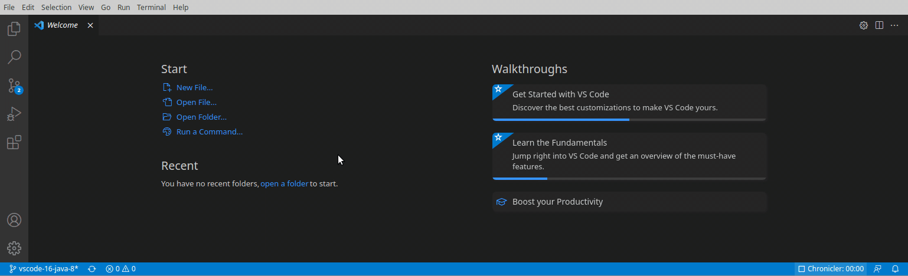

example omega edit extension
===



Example VS Code plugin that uses Scala [Omega Edit](https://github.com/scholarsmate/omega-edit) bindings to demonstrate interaction over both gRPC.

## areas for improvement
- the proto file is currently duplicated between the server and client projects
  - the proto compilation for the client wants to create a nested path based on the input directory which complicates sharing it from a central location
  - ideally we would keep it at a top level directory and specify the path in the package.json and load that in the server and client builds
- the input area in the client is pretty naive in that it is populated with the entire contents of the session
  - this should instead be a viewport that moves based on input keys/scrollbar
- the file name that is opened, `build.sbt`, is hardcoded in the gui client
  - passing the filename as a launch profile argument would make for a good example of how it will be used in real use

## build and launch

Publish the Omega Edit Scala API locally with `sbt +publishLocal` from the Omega Edit Scala bindings project.

Omega Edit shared library > `0.7.0` required.

### backend 

`sbt compile grpc/run`

### frontend

Launch with 

```
yarn
yarn package
code --extensionDevelopmentPath=<this-project-dir>
```

Type omega at the command palette (`ctrl+shift+p`)

### references
- https://github.com/scholarsmate/omega-edit
- https://github.com/microsoft/vscode-extension-samples
- https://github.com/badsyntax/grpc-js-typescript
